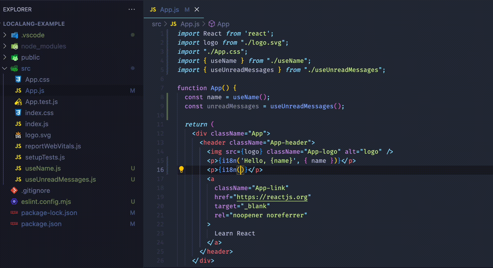

# Localang

[](https://github.com/localang/localang-i18n-js/actions/workflows/continuous-integrations.yaml)

This is a localization toolkit:
1. I18n JS library
2. ESLint plugin for automatic generation of files with translations
3. Service for translators/managers/non-developers to change translations
4. Ready-made Github Actions to synchronize translations between the service and your code

See [documentation](https://docs.localang.xyz/docs/i18n-js/getting-started).



## Installation

This library is published in the NPM registry and can be installed using any compatible package manager.

```sh
npm install localang-i18n-js --save

# For Yarn, use the command below.
yarn add localang-i18n-js
```

## Documentation

[Documentation](https://docs.localang.xyz/docs/i18n-js/getting-started).

## License

Released under [MIT License](./LICENSE).
