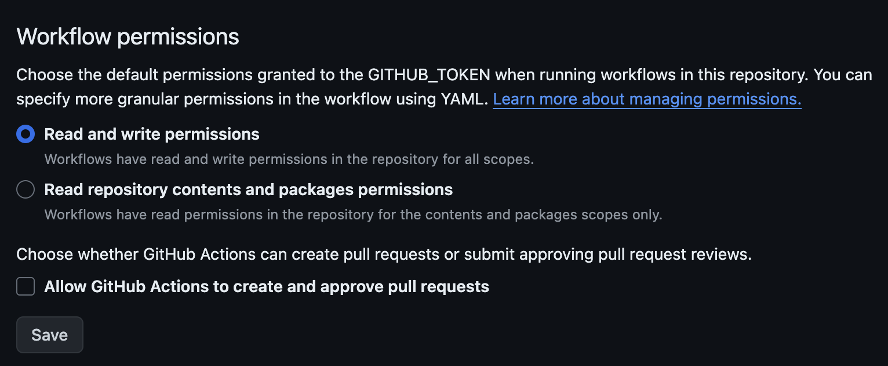

# Github Actions

> ⚠️ **Deprecated.** These Actions synchronized translations with the hosted Localang
> service, which has been **discontinued**. They no longer have a working backend and are
> kept here for reference only. The i18n library and the [ESLint plugin](./i18n-file-generator.md)
> remain fully usable without them.

To automatically synchronize files between the hosted Localang service and your codebase, you could use Github Actions.

## Preparation

1. You needed an API key stored in the secrets of your repository.
2. For Pull Action, you needed to give write permissions for GITHUB_TOKEN in Workflow Permissions:
   
3. For workflows to work properly you should not manually edit the I18n files, everything should be served by the [ESLint plugin](./i18n-file-generator.md).

## Pull translations

You could automatically download translations from the service and update the files in your repository.

### Example of use in a separate workflow

**.github/workflows/pull-translations.yaml**:

```yaml
name: Pull Translations from Localang

on:
  schedule:
    - cron:  '0 * * * *'

jobs:
  push-translations:
    runs-on: ubuntu-latest

    steps:
      - name: Check out the repository
        uses: actions/checkout@v3

      - name: Pull translations
        uses: pavelpilyak/localang-i18n-js-pull-action@v0.0.2
        with:
          api-key: ${{ secrets.LOCALANG_API_KEY }}
          project-id: 1

      - name: Commit translations
        run: |
          git config --global user.name 'Localang'
          git config --global user.email 'localang@users.noreply.github.com'
          git commit -am "Automatic translation merge"
          git push
```

## Push translations

You could also automatically upload keysets created by the [ESLint plugin](./i18n-file-generator.md) to the service.

### Example of use in a separate workflow

**.github/workflows/push-translations.yaml**:

```yaml
name: Push Translations to Localang

on:
  push:
    branches:
      - master

jobs:
  push-translations:
    runs-on: ubuntu-latest

    steps:
      - name: Check out the repository
        uses: actions/checkout@v3
        with:
          fetch-depth: 0

      - name: Push translations
        uses: pavelpilyak/localang-i18n-js-push-action@v0.0.2
        with:
          api-key: ${{ secrets.LOCALANG_API_KEY }}
          project-id: 1
          file-extension: i18n.js
```
