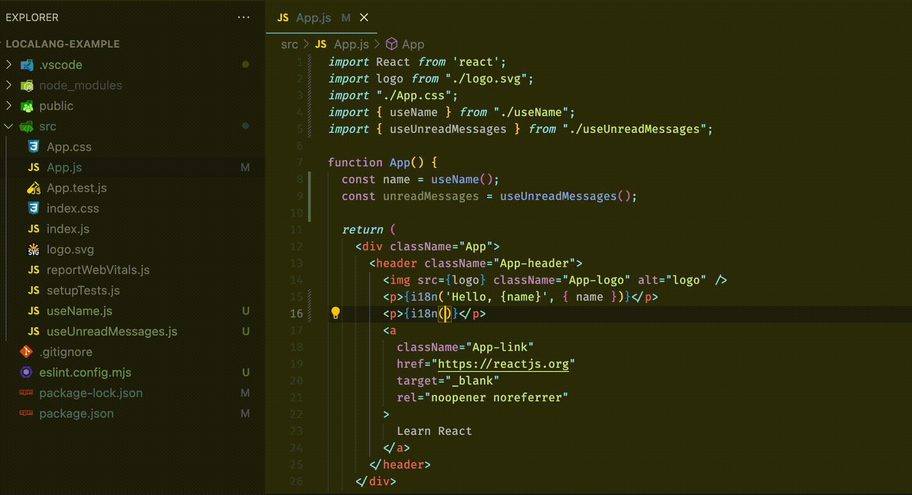

# I18n File Generator

If you use eslint with version >= 8.50 and use [flat config](https://eslint.org/docs/latest/extend/plugin-migration-flat-config), then you can use the plugin for automatic generation of translation files.



## Usage

You need to add the plugin to your eslint config (**It is important to place the rules at the very beginning of the config**):

```javascript
import { createEslintPlugin } from 'localang-i18n-js';

const config: FlatConfig = [
    {
        plugins: {
            localang: createEslintPlugin({
                /**
                 * Key will be the default translation for some language
                 * @default en
                 */
                keyLanguage: 'en',
                /**
                 * Languages in use
                 * @default ['en']
                 */
                langs: ['en', 'ar'],
                /**
                 * Generated file extension
                 * @default js
                 */
                fileExt: 'js',
                /**
                 * Import/export type for i18n files
                 * @default module
                 */
                importType: 'module',
                /**
                 * Automatically adds import i18n-function from a translation file.
                 * May not work as expected in IDE with ESLint auto-correct via save
                 * @default false
                 */
                addI18nImportToBaseFile: false,
            }),
        },
        rules: {
            'localang/generate-i18n-file': 'error',
        },
    },
    // Since parsing of i18n-files is based on JSON.parse, it is necessary to disable validation of such files:
    { ignores: ['**/*.i18n.*'] },
    ...
]
```

Now the files will be created and deleted automatically if any of the js/ts files contain a code like `i18n('Some text')` when you run eslint (you can validate the files when you save them in your IDE).

By default, the key text (the string passed to the `i18n()` call) will be used as the translation for the language from `keyLanguage`.
